# VulnScape Labs

A comprehensive Docker-based cybersecurity training platform featuring hands-on labs for **SSRF** (Server-Side Request Forgery), **SSTI** (Server-Side Template Injection), and **CSTI** (Client-Side Template Injection) vulnerabilities.

## 🎯 Overview

VulnScape Labs provides an isolated, containerized environment for learning and practicing web application security vulnerabilities. Each lab is designed with progressive difficulty levels and realistic scenarios.

## 🏗️ Architecture

### SSRF Lab Network Topology

```mermaid
graph TB
    subgraph "Public Network"
        Dashboard["Dashboard<br/>Port 80"]
        User["User Browser"]
    end
    
    subgraph "SSRF Labs (Ports 8081-8086)"
        Lab1["Lab 1: Basic SSRF<br/>Port 8081<br/>(PHP)"]
        Lab2["Lab 2: Blacklist Bypass<br/>Port 8082<br/>(Flask)"]
        Lab3["Lab 3: Whitelist Bypass<br/>Port 8083<br/>(Express)"]
        Lab4["Lab 4: DNS Rebinding<br/>Port 8084<br/>(Go)"]
        Lab5["Lab 5: Blind SSRF<br/>Port 8085<br/>(Flask)"]
        Lab6["Lab 6: Gopher/Redis<br/>Port 8086<br/>(PHP)"]
    end
    
    subgraph "Internal Network (169.254.0.0/16)"
        Admin["Admin Panel<br/>internal-admin"]
        Metadata["Cloud Metadata Service<br/>169.254.169.254"]
        Redis["Redis Database<br/>redis:6379"]
        Secret["Secret Service<br/>Port 8080"]
    end
    
    User -->|Access| Dashboard
    User -->|Direct Access| Lab1
    User -->|Direct Access| Lab2
    User -->|Direct Access| Lab3
    User -->|Direct Access| Lab4
    User -->|Direct Access| Lab5
    User -->|Direct Access| Lab6
    
    Lab1 -.->|SSRF Target| Admin
    Lab1 -.->|SSRF Target| Metadata
    Lab1 -.->|SSRF Target| Secret
    
    Lab2 -.->|SSRF Target| Admin
    Lab2 -.->|SSRF Target| Metadata
    Lab2 -.->|SSRF Target| Secret
    
    Lab3 -.->|SSRF Target| Admin
    Lab3 -.->|SSRF Target| Metadata
    Lab3 -.->|SSRF Target| Secret
    
    Lab4 -.->|SSRF Target| Admin
    Lab4 -.->|SSRF Target| Metadata
    Lab4 -.->|SSRF Target| Secret
    
    Lab5 -.->|SSRF Target| Admin
    Lab5 -.->|SSRF Target| Metadata
    Lab5 -.->|SSRF Target| Secret
    
    Lab6 -.->|SSRF Target| Admin
    Lab6 -.->|SSRF Target| Metadata
    Lab6 -.->|SSRF Target| Redis
    Lab6 -.->|SSRF Target| Secret
    
    style Metadata fill:#fef3c7
    style Admin fill:#fee2e2
    style Redis fill:#fecaca
    style Secret fill:#ddd6fe
```



## 📚 Lab Categories

### 🔗 SSRF Labs (6 Labs)

| Lab | Difficulty | Technology | Description | Port |
|-----|-----------|------------|-------------|------|
| Lab 1 | Easy | PHP | Basic SSRF with no protections | 8081 |
| Lab 2 | Medium | Flask | Bypass localhost blacklist filters | 8082 |
| Lab 3 | Medium | Express | Bypass domain whitelist restrictions | 8083 |
| Lab 4 | Hard | Go | Exploit TOCTOU via DNS rebinding | 8084 |
| Lab 5 | Hard | Flask | Blind SSRF with no response output | 8085 |
| Lab 6 | Expert | PHP | Advanced Gopher protocol to Redis | 8086 |

#### SSRF Internal Targets

Each SSRF lab can access the following internal services:

- **Admin Panel** (`http://127.0.0.1:PORT/admin`) - Restricted admin interface
- **Secret Service** (`http://127.0.0.1:8080`) - Internal HTTP service
- **Cloud Metadata** (`http://169.254.169.254/metadata.json`) - Simulated AWS/GCP metadata service
- **Redis** (`redis:6379`) - Internal Redis database (Lab 6 only)

### 🎨 SSTI Labs (3 Labs)

| Lab | Difficulty | Technology | Description | Port |
|-----|-----------|------------|-------------|------|
| Lab 1 | Easy | Jinja2 (Flask) | Basic template injection | 8087 |
| Lab 2 | Medium | EJS (Express) | Prototype pollution via templates | 8088 |
| Lab 3 | Hard | Twig (PHP) | Advanced RCE through templates | 8089 |

### 💻 CSTI Labs (3 Labs)

| Lab | Difficulty | Technology | Description | Port |
|-----|-----------|------------|-------------|------|
| Lab 1 | Medium | Angular | Client-side template injection | 8090 |
| Lab 2 | Medium | Vue.js | XSS via client templates | 8091 |
| Lab 3 | Hard | Alpine.js | Advanced CSTI exploitation | 8092 |

## 🚀 Quick Start

### Prerequisites

- Docker
- Docker Compose

### Installation

1. Clone the repository:
```bash
git clone <repository-url>
cd ssrf_ssti
```

2. Start all labs:
```bash
docker-compose up -d --build
```

3. Access the dashboard:
```
http://localhost
```

### Accessing Individual Labs

- **Dashboard**: http://localhost
- **SSRF Labs**: http://localhost:8081 - 8086
- **SSTI Labs**: http://localhost:8087 - 8089
- **CSTI Labs**: http://localhost:8090 - 8092

## 🎓 Learning Path

### Recommended Order

1. **Start with SSRF Lab 1** - Understand basic SSRF concepts
2. **Progress through SSRF Labs 2-4** - Learn bypass techniques
3. **Attempt SSRF Labs 5-6** - Master advanced exploitation
4. **Move to SSTI Labs** - Learn template injection
5. **Finish with CSTI Labs** - Understand client-side attacks

## 🔧 Lab Features

### SSRF Labs Include:

- ✅ Multiple internal targets for exploitation
- ✅ Progressive difficulty with different filters
- ✅ Realistic cloud metadata service simulation
- ✅ "Open in New Tab" button for easier testing
- ✅ Visual hints for internal targets
- ✅ Multiple programming languages and frameworks

### General Features:

- 🐳 Fully containerized with Docker
- 🌐 Isolated network environments
- 📊 Interactive dashboard for lab selection
- 🎯 Realistic vulnerability scenarios
- 📝 Hints and guidance for each lab

## 🛠️ Technical Details

### Network Configuration

- **Public Network**: Accessible from host machine
- **Lab Network** (`169.254.0.0/16`): Internal network for SSRF targets
  - Simulates cloud provider metadata IP range
  - Isolated from public network

### Port Mapping

All labs use matching internal and external ports to avoid confusion:
- Internal port 8081 → External port 8081
- Internal port 8082 → External port 8082
- etc.

## 📖 Usage Tips

### SSRF Labs

1. Start by reading the hints on each lab's landing page
2. Use the "Open in New Tab" button for easier testing
3. Try accessing internal services via the SSRF vulnerability
4. Experiment with different bypass techniques for filtered labs

### Example SSRF Payloads

**Lab 1 (Basic):**
```
http://127.0.0.1:8081/admin
http://169.254.169.254/metadata.json
```

**Lab 2 (Blacklist Bypass):**
```
http://127.1:8082/admin
http://0x7f.0x0.0x0.0x1:8082/admin
```

**Lab 3 (Whitelist Bypass):**
```
http://vulnscape.com@127.0.0.1:8083/admin
http://127.0.0.1.vulnscape.com.nip.io:8083/admin
```

## 🧹 Cleanup

Stop all labs:
```bash
docker-compose down
```

Remove all containers and networks:
```bash
docker-compose down -v
```

## 🤝 Contributing

Contributions are welcome! Feel free to:
- Add new labs
- Improve existing vulnerabilities
- Enhance documentation
- Report bugs

## ⚠️ Disclaimer

This platform is for **educational purposes only**. The vulnerabilities demonstrated here should only be tested in controlled environments. Never attempt these techniques on systems you don't own or have explicit permission to test.

## 📄 License

This project is provided as-is for educational purposes.

---

**Happy Hacking! 🎯**
